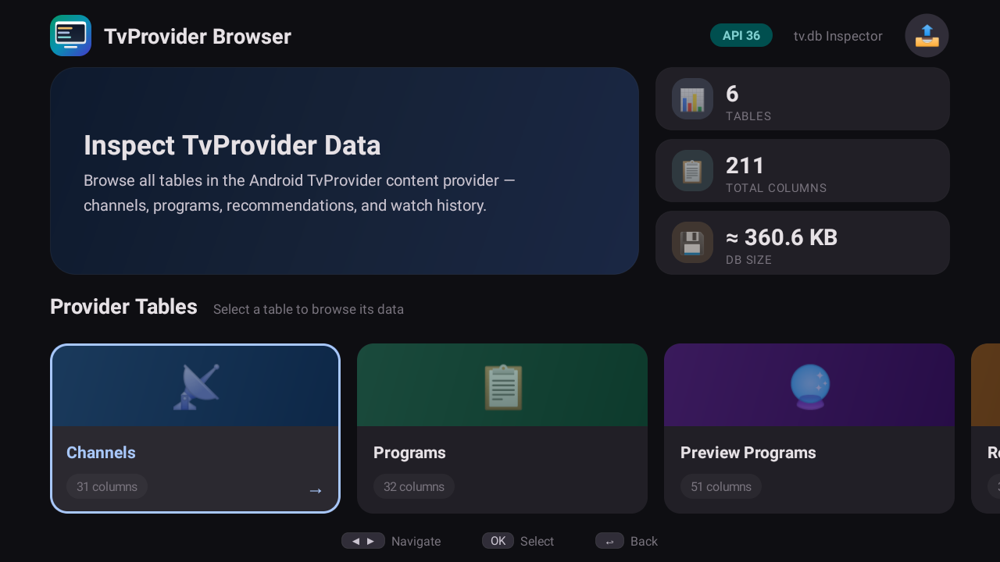
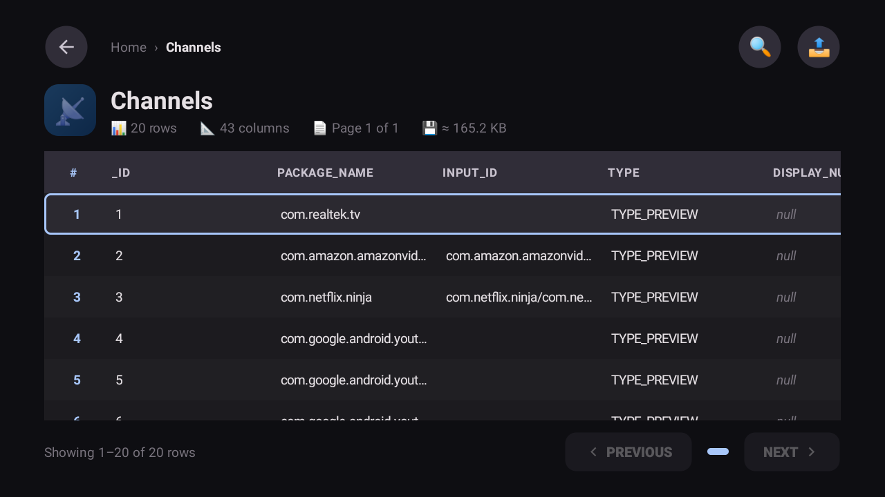
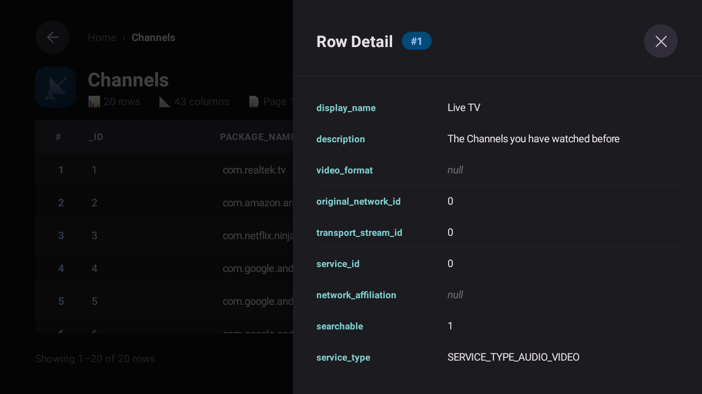
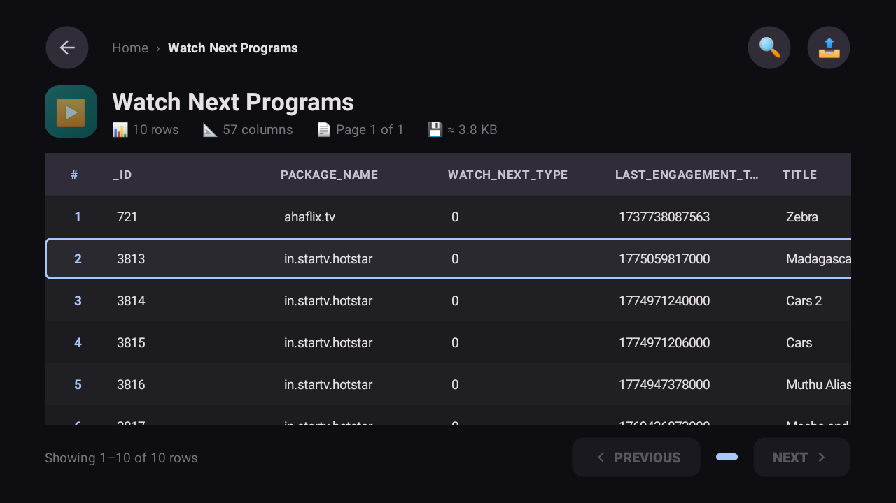
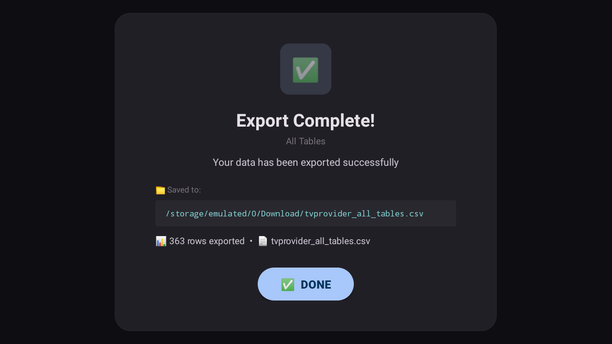

# 📺 TvProvider Browser

A developer-focused Android TV app that lets you browse and inspect every table inside the system **TvProvider** (`tv.db`). Think of it as a database viewer purpose-built for the TV form factor — full D-pad navigation, paginated data grids, row detail panels, and storage stats at a glance.

<p align="center">
  
</p>

---

## ✨ Features

| Feature | Description |
|---|---|
| **6 TvProvider tables** | Channels, Programs, Preview Programs, Recorded Programs, Watch Next Programs, Watched Programs |
| **Paginated data grid** | 50 rows per page with horizontal + vertical scrolling and a sticky header row |
| **Row detail panel** | Click any row to open a slide-in panel showing every column/value pair |
| **Storage estimates** | Per-table data size and total `tv.db` file size (when accessible) |
| **TV-first UI** | Full D-pad / remote navigation, focus management, and Leanback-optimized layout |
| **CSV export** | Export single tables or all tables to CSV — choose Downloads, App Files, or USB/SD storage with a dedicated progress screen showing the exact output path |
| **Dark theme** | Purpose-built dark color scheme for big-screen readability |
| **Runtime permission** | Requests `READ_TV_LISTINGS` on launch; gracefully shows a permission gate |
| **BLOB & null handling** | BLOBs displayed as `BLOB(n bytes)`, nulls styled in italic |

---

## 📸 Screenshots

| Home Screen | Table Data View |
|---|---|
|  |  |

| Row Detail Panel | Watched Programs |
|---|---|
|  |  |

| Export Screen |
|---|
|  |

---

## 🏗️ Architecture

```
TvProviderBrowserApp          ← Hilt Application
└── MainActivity              ← Single-activity host (NavHost)
    ├── HomeFragment          ← Table cards + permission gate
    ├── TableDataFragment     ← Paged grid, detail overlay
    └── ExportProgressFragment ← Storage picker, progress & result
```

| Layer | Stack |
|---|---|
| **UI** | Android Views + Fragments, Navigation Component, Leanback `VerticalGridView` |
| **Pattern** | MVVM — `HomeViewModel`, `TableDataViewModel`, `ExportProgressViewModel` |
| **DI** | Hilt (`@AndroidEntryPoint`, `@Singleton` repository) |
| **Data** | `TvProviderRepository` queries tables via `ContentResolver` with client-side paging |

### Key Components

- **`TvProviderRepository`** — Queries any TvProvider URI, handles paging (50 rows/page), BLOB detection, column reordering to match the real `tv.db` schema, and storage estimation.
- **`LeanbackTableView`** — Custom compound view wrapping a `VerticalGridView` inside a `HorizontalScrollView` for a spreadsheet-like data grid with full D-pad navigation.
- **`TvTables`** — Declarative table registry with URIs, column orderings, icons, and descriptions for all 6 TvProvider tables.

---

## 🚀 Getting Started

### Prerequisites

- **Android Studio** Ladybug or newer (AGP 9.x)
- **JDK 11+**
- An **Android TV** device or emulator (API 23+) with TvProvider data  
  *(e.g., set up the [Live Channels](https://play.google.com/store/apps/details?id=com.google.android.tv) app or any TV input service)*

### Build from source

```bash
# Clone the repository
git clone https://github.com/<your-username>/TvProviderBrowser.git
cd TvProviderBrowser

# Build the debug APK
./gradlew assembleDebug
```

The APK is output to:
```
app/build/outputs/apk/debug/app-debug.apk
```

A pre-built release APK is also available at [`apk/TvProviderBrowser.apk`](apk/TvProviderBrowser.apk).

### Install on device

```bash
# Install via ADB (device must be connected)
adb install -r app/build/outputs/apk/debug/app-debug.apk

# Or install the pre-built APK
adb install -r apk/TvProviderBrowser.apk
```

### Grant permission

On first launch the app will request the **`READ_TV_LISTINGS`** permission. You can also grant it via ADB:

```bash
adb shell pm grant com.mahesh.tvproviderbrowser android.permission.READ_TV_LISTINGS
```

---

## 📋 TvProvider Tables

| Table | URI | Description |
|---|---|---|
| 📡 **Channels** | `content://android.media.tv/channel` | Input sources, display names, app links & browsable flags |
| 📋 **Programs** | `content://android.media.tv/program` | EPG entries with titles, genres, ratings & schedules |
| 🔮 **Preview Programs** | `content://android.media.tv/preview_program` | Home screen recommendation cards with preview media & deep links |
| ⏺ **Recorded Programs** | `content://android.media.tv/recorded_program` | DVR recordings with file URIs, duration & expiry timestamps |
| ▶️ **Watch Next Programs** | `content://android.media.tv/watch_next_program` | Continue watching & up-next queue entries |
| 👁️ **Watched Programs** | `content://android.media.tv/watched_program` | System viewing history — tracks watched channels & timestamps |

---

## 🛠️ Tech Stack

| Category | Library / Tool |
|---|---|
| Language | Kotlin 2.0 |
| Min SDK | 23 (Android 6.0) |
| Target SDK | 36 |
| UI Framework | Android Views, Fragments, Leanback |
| Navigation | Jetpack Navigation + SafeArgs |
| DI | Hilt / Dagger |
| Async | Kotlin Coroutines + Flow |
| TV Support | AndroidX Leanback, TvProvider |
| Build | Gradle (Kotlin DSL), Version Catalog |

---

## 📁 Project Structure

```
app/src/main/java/com/mahesh/tvproviderbrowser/
├── TvProviderBrowserApp.kt          # Hilt Application class
├── MainActivity.kt                  # Single-activity NavHost
├── data/
│   ├── export/
│   │   ├── CsvExporter.kt          # Single-table CSV writer (RFC 4180)
│   │   ├── CsvAllTablesExporter.kt  # Multi-table CSV writer
│   │   └── ExportFileWriter.kt      # Downloads / MediaStore / file-path writer
│   ├── model/
│   │   ├── TvTable.kt              # Table data class
│   │   ├── TvTables.kt             # All 6 table definitions + column orders
│   │   └── TableResult.kt          # Query result wrapper
│   └── repository/
│       └── TvProviderRepository.kt  # ContentResolver queries + paging
├── di/
│   └── AppModule.kt                 # Hilt module (provides ContentResolver)
└── ui/
    ├── components/
    │   └── DataTableView.kt         # LeanbackTableView (custom grid widget)
    ├── export/
    │   ├── ExportLocationPickerFragment.kt  # Storage location chooser dialog
    │   ├── ExportProgressFragment.kt        # Export progress & result screen
    │   └── ExportProgressViewModel.kt       # Export state machine & IO
    ├── home/
    │   ├── HomeFragment.kt          # Table card list + permission gate
    │   └── HomeViewModel.kt         # Home screen state
    └── tabledata/
        ├── TableDataFragment.kt     # Paged data grid + detail panel
        └── TableDataViewModel.kt    # Page loading, navigation, storage stats
```

---

## 🤝 Contributing

Contributions are welcome! Here's how to get started:

1. **Fork** the repository
2. **Create** a feature branch: `git checkout -b feature/my-feature`
3. **Commit** your changes: `git commit -m 'Add my feature'`
4. **Push** to the branch: `git push origin feature/my-feature`
5. **Open** a Pull Request

Please make sure your code follows the existing code style and passes a clean build (`./gradlew assembleDebug`).

---

## 📄 License

This project is open source. See the [LICENSE](LICENSE) file for details.

---

## 🙏 Acknowledgements

- [AndroidX TvProvider](https://developer.android.com/reference/androidx/tvprovider/media/tv/package-summary) for the content provider contract
- [AndroidX Leanback](https://developer.android.com/training/tv/start/start) for TV-optimized UI components
- [Hilt](https://dagger.dev/hilt/) for dependency injection
